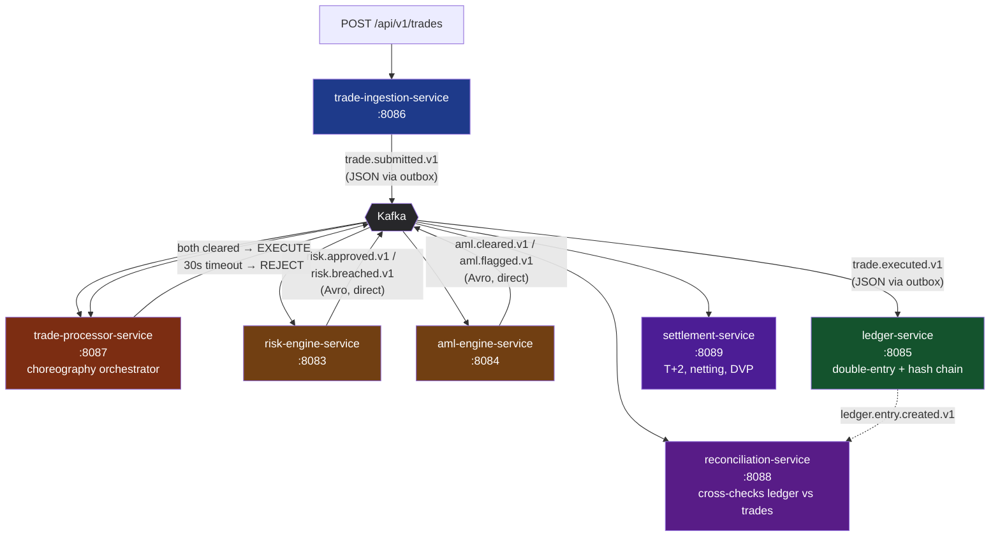

<div align="center">

# RTRS — Real-Time Trade & Risk System

### Microservices platform simulating a trading desk's post-trade pipeline, built to learn the engineering patterns real trading systems use

[](https://openjdk.org/projects/jdk/21/)
[](https://spring.io/projects/spring-boot)
[](https://kafka.apache.org/)
[](https://www.postgresql.org/)
[](https://spring.io/projects/spring-batch)
[](#-status--scope)

</div>

---

> **This is a personal learning project, built to develop and demonstrate real
> distributed-systems engineering skill.** It is not a production system and is still actively being
> extended. Every claim below is backed by real, traced, working code — see
> [`docs/`](./docs) for the receipts.

## What This Is

RTRS simulates the back-end of a trading desk — the part nobody outside
engineering ever sees. A trade comes in, gets risk-checked, gets screened for
money laundering, executes, gets recorded in an immutable ledger, settles two
days later, and gets independently reconciled to make sure nothing went
wrong anywhere along the way.

Seven independently deployable services, seven separate databases, one Kafka backbone 
connecting them. The focus was on implementing real distributed-systems patterns 
correctly — the outbox pattern, choreography sagas under concurrency, double-entry 
bookkeeping with a tamper-evident hash chain, multilateral netting, and DVP settlement 
validation — rather than just wiring services together.

## Architecture



## The Seven Services

| Service | Port | Role |
|---|---|---|
|  **trade-ingestion** | 8086 | Entry point — validates and accepts trades |
|  **trade-processor** | 8087 | Choreography orchestrator — aggregates risk + AML verdicts, executes or rejects |
|  **risk-engine** | 8083 | Position limit, VaR, and concentration checks |
|  **aml-engine** | 8084 | Five AML typologies — structuring, round-amount, layering, sanctions, high-value |
|  **ledger-service** | 8085 | Double-entry bookkeeping, SHA-256 hash-chained, append-only |
|  **settlement-service** | 8089 | T+2 settlement, multilateral netting, DVP validation, Spring Batch EOD job |
|  **reconciliation-service** | 8088 | Independently cross-checks ledger vs trade records, every minute |

Full breakdown of each service — classes, design decisions, what it consumes
and publishes — lives in [`docs/architecture/`](./docs/architecture).

## What's Worth Looking At

- **The outbox pattern, implemented correctly, twice.** An async-publish race
  condition that caused duplicate Kafka events was found and fixed with a
  synchronous send — see
  [`troubleshooting/005`](./docs/troubleshooting/005-outbox-duplicate-events.md).
- **A choreography saga that survives real concurrency.** Risk and AML
  verdicts can arrive before the approval-state row even exists, or two
  consumer threads can race to flip the same flag. Both are handled with
  pessimistic locking and graceful retry, not assumed away —
  [`troubleshooting/007`](./docs/troubleshooting/007-aml-risk-race-condition.md).
- **A ledger with a tamper-evident hash chain**, not just an append-only
  table. Every entry's hash depends on the exact UUID and timestamp that get
  persisted — getting this wrong (letting JPA auto-generate the ID after the
  hash was already computed) silently broke chain verification until it was
  caught and fixed.
- **Multilateral netting and genuine DVP**, not a fake CCP simulation or a
  cash-only check pretending to be DVP. Settlement tracks real security
  positions specifically so the "Delivery" half of Delivery-vs-Payment means
  something.
- **A real Spring Batch job**, not a `@Scheduled` method dressed up as one —
  `JobRepository`, chunked processing, fault tolerance, full execution
  history.
- **Three real, traced trade outcomes** — a clean execution, an AML-only
  rejection, and a trade independently flagged by both risk *and* AML for
  different reasons — verified end-to-end with actual logs, not assumed to
  work. See
  [`08-happy-path`](./docs/system-design/08-happy-path-trade-lifecycle.md)
  and [`09-rejection-paths`](./docs/system-design/09-rejection-paths.md).

## Tech Stack

| Layer | Choice |
|---|---|
| Language / Runtime | Java 21, Spring Boot 4 |
| Messaging | Apache Kafka (KRaft mode, 3 brokers) |
| Schema | Avro + Confluent Schema Registry (BACKWARD compatibility) |
| Database | PostgreSQL 17, one instance per service, Flyway-managed |
| Caching | Redis (idempotency keys) |
| Batch Processing | Spring Batch 6 |
| Orchestration (local) | Spring State Machine (per-trade keyed instances) |
| Observability | Prometheus, Grafana, Loki, Tempo (the "LGTM" stack) |
| Build | Gradle (services), Maven (shared libraries) |
| Infra | Docker Compose |

## Getting Started

```bash
# 1. Install shared libraries to local Maven (one-time, per machine)
./setup.sh          # macOS/Linux
setup.bat           # Windows

# 2. Copy the env template and set a real JWT secret
cp .env.example .env

# 3. Bring up infrastructure
docker compose up -d

# 4. Run each service's Flyway migration against its own database
#    (see docs/troubleshooting/004 for the exact commands per service)

# 5. Start each service (IntelliJ, or ./gradlew bootRun per service)

# 6. Send a trade
curl -X POST http://localhost:8086/api/v1/trades \
  -H "Content-Type: application/json" \
  -d '{
    "clientOrderRef": "ORDER-001",
    "accountId": "550e8400-e29b-41d4-a716-446655440000",
    "instrumentId": "AAPL",
    "tradeType": "BUY",
    "quantity": 100,
    "limitPrice": 150.00,
    "currency": "USD"
  }'
```

Watch it move through every service's logs — submission → risk → AML →
execution → ledger → settlement → reconciliation.

## Documentation Map

This project treats documentation as seriously as code. Four folders, four
different jobs:

| Folder | Answers |
|---|---|
| [`docs/architecture/`](./docs/architecture) | *How does this actually work?* Per-service breakdowns, plus two full traced trade walkthroughs (happy path and rejections). |
| [`docs/architecture-decision-records/`](./docs/architecture-decision-records) | *Why was it built this way?* 13 ADRs — Kafka over alternatives, the outbox pattern, CQRS, the Avro/JSON serialization boundary, and more. |
| [`docs/troubleshooting/`](./docs/troubleshooting) | *What broke, and how was it actually fixed?* 11 real incidents — race conditions, serializer mismatches, Spring Batch API migrations — each with root cause and fix. |
| [`docs/future/`](./docs/future) | *What's deliberately deferred, and why?* 12 documented improvements — Debezium CDC, ML-based AML detection, Kubernetes deployment, distributed tracing — each scoped with an honest effort estimate. |

## Status & Scope

This is a learning project, built solo, and still under active development.
A few things are true right now, on purpose:

- **Authentication exists but isn't wired up.** `rtrs-security`'s JWT
  validation and role-based access control are fully implemented and
  correct — there's just no filter yet that populates the request with an
  authenticated user, because the auth-issuing service itself hasn't been
  built.
- **Distributed tracing is designed but not completed.** The full OpenTelemetry
    + Tempo stack is running and correctly configured; propagating trace
      context across the outbox's thread hand-off is the one piece left, and
      it's documented precisely rather than left vague.
- **Three services are placeholders**: `api-gateway`, `audit-service`, and
  `market-data-service` exist as empty skeletons with their intended design
  written up in `docs/future/`, not built yet.

If you're reading this as part of a hiring process: every architectural
claim above can be traced to real code and real logs in this repo. Nothing
here is aspirational marketing copy — it's documentation of work actually
done, including the parts that aren't finished yet.